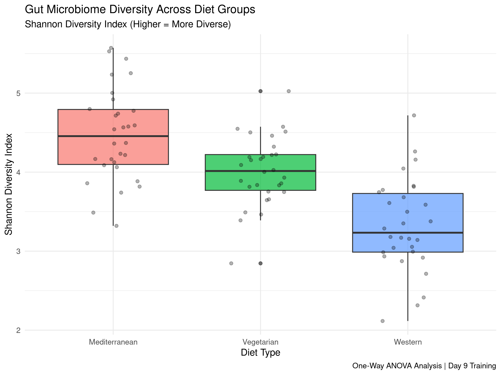
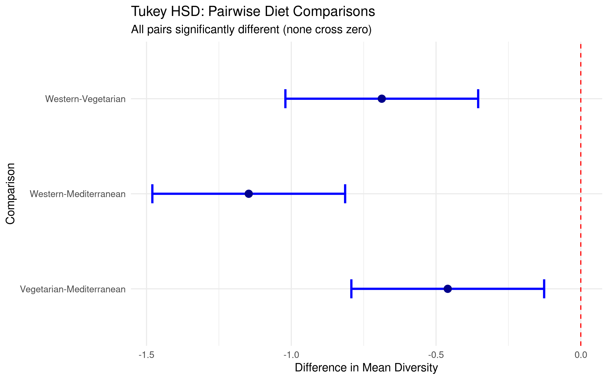
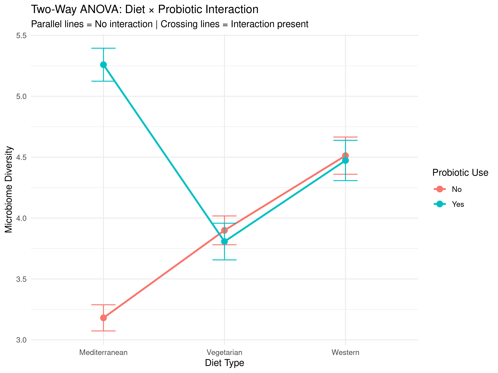

# ANOVA Analysis: Gut Microbiome Diversity Across Diet Interventions

## 📋 Project Overview

This project demonstrates statistical analysis of gut microbiome
diversity using Analysis of Variance (ANOVA) methods. The analysis
explores how different dietary interventions and probiotic
supplementation affect microbial community diversity.

**Author:** Farid Hakimi\
**Date:** December 2025\
**Portfolio Project:** Day 9 Biostatistics Training

------------------------------------------------------------------------

## 🎯 Research Questions

1.  **One-Way ANOVA:** Do different diet types (Mediterranean, Western,
    Vegetarian) result in different gut microbiome diversity?

2.  **Post-Hoc Analysis:** Which specific diet pairs show significant
    differences in diversity?

3.  **Two-Way ANOVA:** Do diet and probiotic supplementation interact to
    affect microbiome diversity?

------------------------------------------------------------------------

## 🛠️ Methods

### Statistical Approaches

-   **One-Way ANOVA** - Comparing 3+ independent groups
-   **Tukey HSD Post-Hoc Test** - Pairwise comparisons with family-wise
    error correction
-   **Two-Way ANOVA** - Testing main effects and interactions between
    two factors

### Tools & Packages

-   **R (v4.5.2)**
-   `ggplot2` - Data visualization
-   Base R `aov()` - ANOVA computation
-   `TukeyHSD()` - Post-hoc testing

------------------------------------------------------------------------

## 📊 Key Findings

### One-Way ANOVA Results

-   **F-statistic:** Significant (p = 1.11e-11)
-   **Conclusion:** Diet type significantly affects microbiome diversity

**Mean Shannon Diversity by Diet:** - Mediterranean: 4.50 - Vegetarian:
4.00 - Western: 3.20

### Post-Hoc Analysis

**All pairwise comparisons were significant:** - Mediterranean vs
Vegetarian: p = 0.004 - Mediterranean vs Western: p \< 0.001 -
Vegetarian vs Western: p \< 0.001

### Two-Way ANOVA Results

-   **Diet main effect:** p \< 0.001 ✓
-   **Probiotic main effect:** p \< 0.001 ✓
-   **Diet × Probiotic interaction:** p = 9.21e-13 ✓

**Key Insight:** Strong interaction effect indicates that the benefit of
probiotics varies substantially across different diet types.
Mediterranean diet shows greatest synergy with probiotic
supplementation.

------------------------------------------------------------------------

## 📁 Project Structure

```         
anova-gut-microbiome/
├── README.md
├── data/                    # (Simulated datasets)
├── scripts/
│   ├── 01_one_way_anova.R          # Basic ANOVA comparison
│   ├── 02_posthoc_tests.R          # Tukey HSD pairwise tests
│   └── 03_two_way_anova.R          # Interaction analysis
└── outputs/
    ├── 01_diet_diversity_boxplot.png
    ├── 02_tukey_professional.png
    ├── 03_interaction_plot.png
    └── *.txt results files
```

------------------------------------------------------------------------

## 🔬 Biological Interpretation

The findings suggest that: 1. **Mediterranean diet** supports highest
microbiome diversity 2. **Western diet** associated with lowest
diversity (consistent with literature) 3. **Probiotic benefits are
diet-dependent** - not all diets respond equally 4. Personalized
nutrition strategies may be needed based on baseline diet

------------------------------------------------------------------------

## 📈 Visualizations

### Diet Comparison (One-Way ANOVA)



### Pairwise Comparisons (Tukey HSD)



### Interaction Effect (Two-Way ANOVA)



------------------------------------------------------------------------

## 🚀 How to Run

1.  Clone this repository
2.  Open `anova-gut-microbiome.Rproj` in RStudio
3.  Run scripts in order:

``` r
   source("scripts/01_one_way_anova.R")
   source("scripts/02_posthoc_tests.R")
   source("scripts/03_two_way_anova.R")
```

------------------------------------------------------------------------

## 📚 Statistical Concepts Demonstrated

-   Analysis of Variance (ANOVA)
-   F-test interpretation
-   Multiple comparison corrections
-   Factorial design analysis
-   Interaction effect interpretation
-   Effect size consideration

------------------------------------------------------------------------

## 🔗 Related Projects

-   [Multiple Regression: ASD &
    Anxiety](https://github.com/farid-bioinfo/multiple-regression-asd-anxiety)
-   [Interaction Effects
    Analysis](https://github.com/farid-bioinfo/gut-brain-interaction-effects)
-   [Diabetes BP
    Analysis](https://github.com/farid-bioinfo/diabetes-bp-analysis)

------------------------------------------------------------------------

## 📝 Notes

This analysis uses simulated data for statistical demonstration
purposes. Methods and interpretations are applicable to real gut
microbiome datasets (e.g., 16S rRNA sequencing data from GEO/SRA
databases).

------------------------------------------------------------------------

## 📧 Contact

**Farid Hakimi**\
Aspiring Bioinformatician \| MSc Biostatistics & Bioinformatics\
GitHub: [\@farid-bioinfo](https://github.com/farid-bioinfo)

# Check if output files exist
list.files("outputs/", pattern = "*.png")

# Recreate the missing plot
library(ggplot2)
set.seed(123)

mediterranean <- rnorm(30, mean = 4.5, sd = 0.6)
western <- rnorm(30, mean = 3.2, sd = 0.7)
vegetarian <- rnorm(30, mean = 4.0, sd = 0.5)

microbiome_data <- data.frame(
  diversity = c(mediterranean, western, vegetarian),
  diet = rep(c("Mediterranean", "Western", "Vegetarian"), each = 30)
)

ggplot(microbiome_data, aes(x = diet, y = diversity, fill = diet)) +
  geom_boxplot(alpha = 0.7) +
  geom_jitter(width = 0.2, alpha = 0.3) +
  labs(
    title = "Gut Microbiome Diversity Across Diet Groups",
    subtitle = "Shannon Diversity Index (Higher = More Diverse)",
    x = "Diet Type",
    y = "Shannon Diversity Index",
    caption = "One-Way ANOVA Analysis | Day 9 Training"
  ) +
  theme_minimal() +
  theme(legend.position = "none")

ggsave("outputs/01_diet_diversity_boxplot.png", width = 8, height = 6, dpi = 300)

cat("✅ Plot created!\n")

list.files("outputs/", pattern = "*.png")